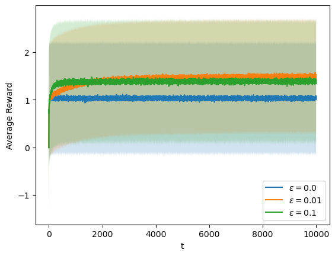
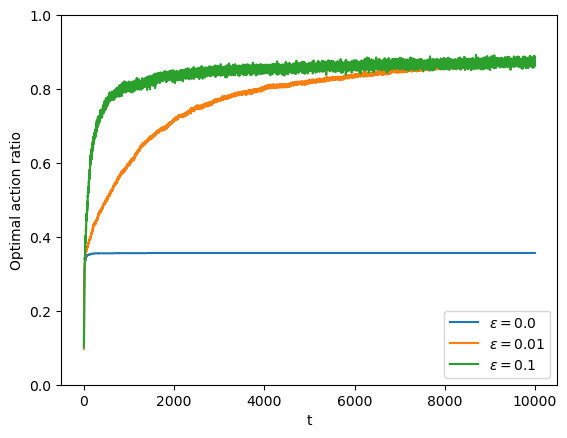
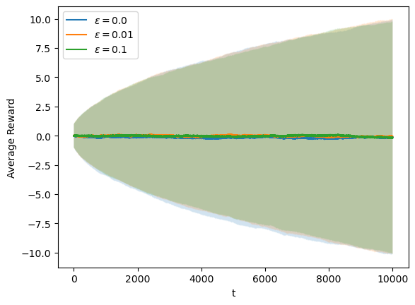
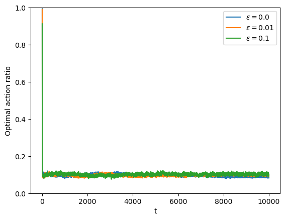
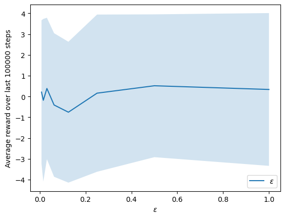

## $\epsilon$-greedy action selection on multi-armed bandits

Solutions to _Exercise 2.5_

### Reproducing solution to 10-armed stationary bandit

### Solution to the nonstationary bandit

> constant step-size ($\alpha=0.1$), $Var(Noise)=0.1$

---

Solution to _Exercise 2.11_

### Parameter study

> constant step-size ($\alpha=0.1$), $Var(Noise)=0.01$

