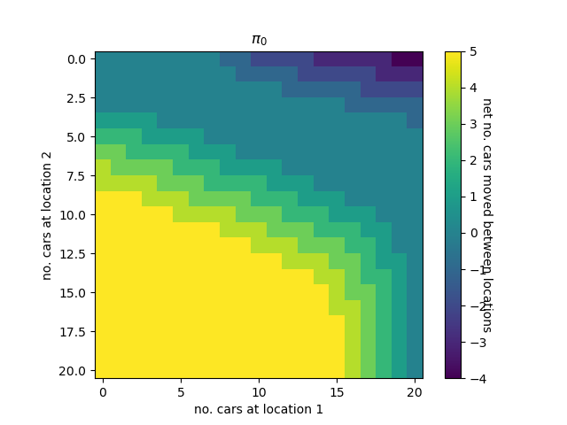
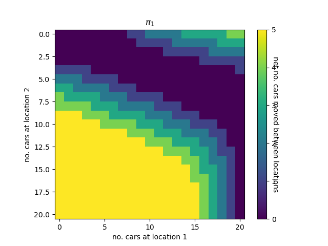
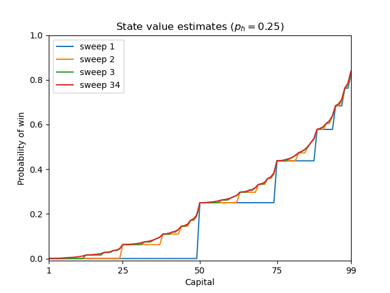
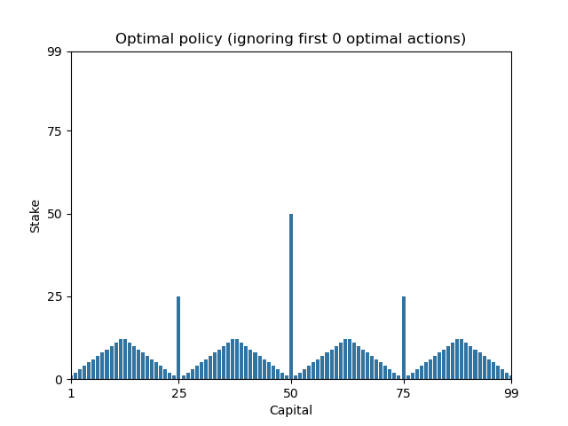
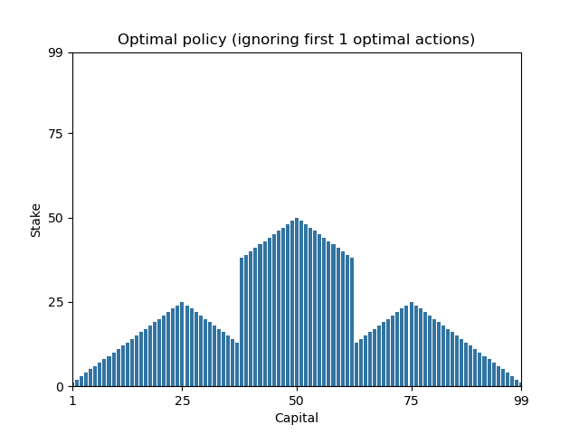
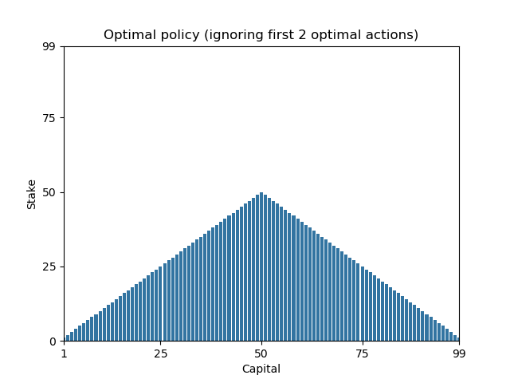
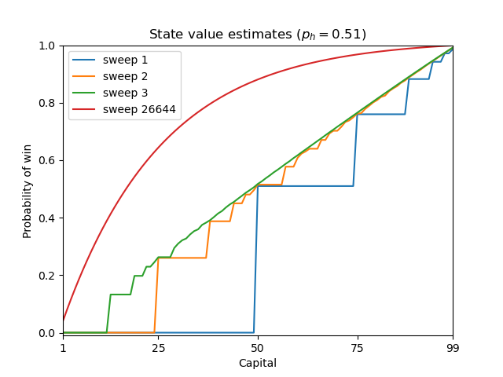
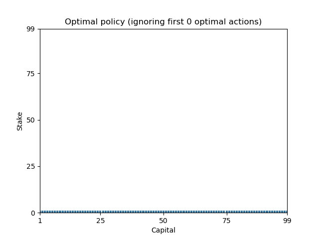

## Policy iteration

Partial solutions to _Exercise 4.7_ (Jack's Car Rental problem)

### Optimal value function

$v_{min}=402.10287936952636$, $v_{max}=607.2791629089214$, $v_{mean}=538.9271065616259$

### Optimal policies

> After 1 iteration

> After 2 iterations

## Value iteration

Example solutions to _Exercise 4.9_ (Gambler problem)

### $p_{head}=0.25$

> Optimal value function

> Optimal policy family

### $p_{head}=0.51$

> Optimal value function

> Optimal policy

- the minor advantage of 0.01 probability leads to an ultrasafe betting strategy that wins over the long run