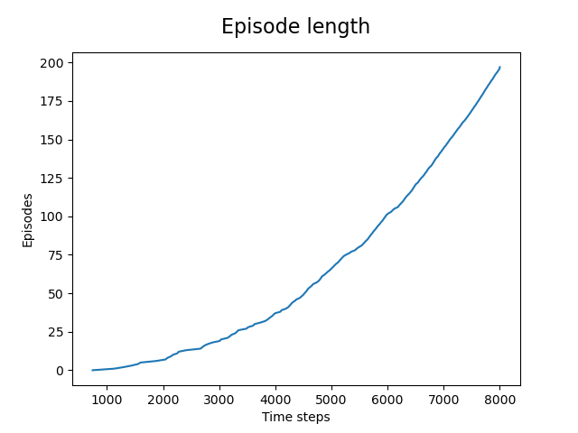
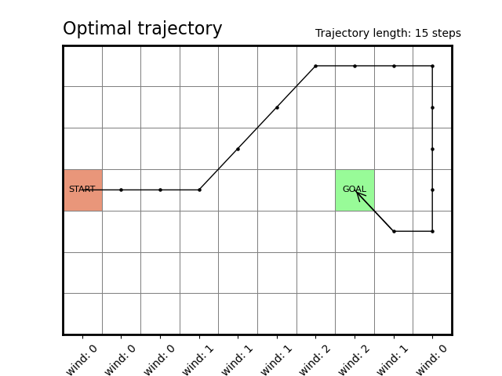
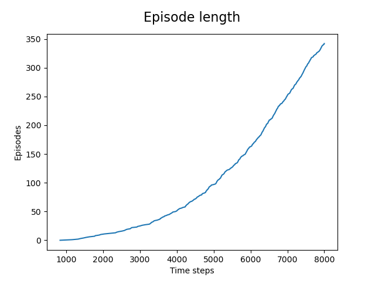
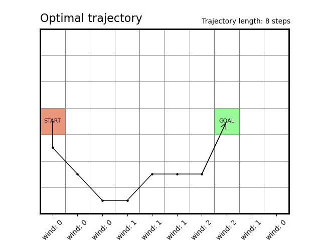
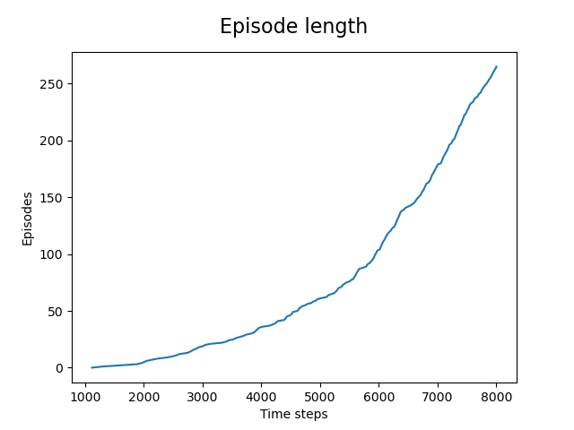
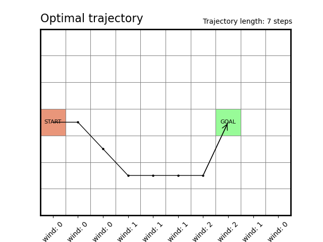
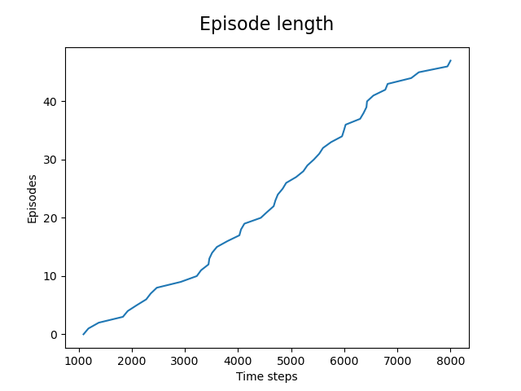
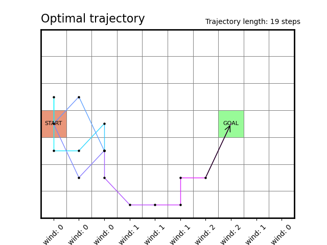

## On-policy TD control (Sarsa)

Solutions to _Exercise 6.9_ (Windy Gridworld problem)

### Four possible actions (vertical+horizontal) _[reproducing book results]_

### Eight possible actions (vertical+horizontal+diagonal)

### Nine possible actions (vertical+horizontal+diagonal+noop)

- found better path than with 8 actions - the no-op action helps obtain more accurate estimates of action values

---

Solutions to _Exercise 6.10_ (Stochastic Wind)

