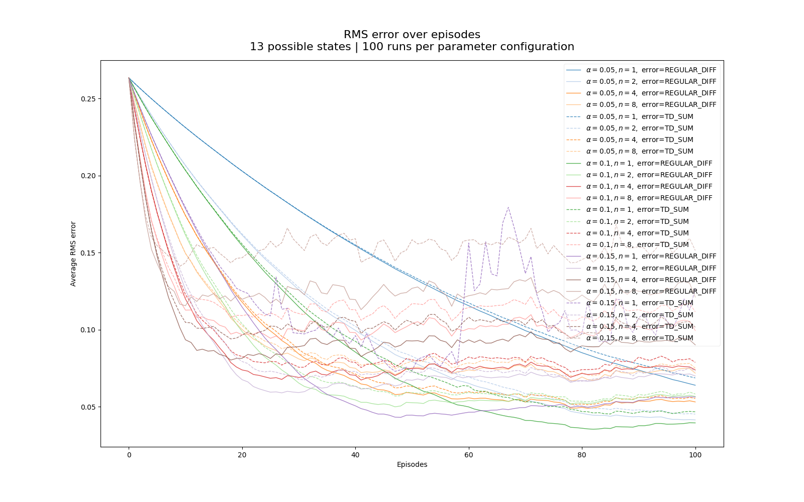

# n-step TD for value estimation

## _Solution to Exercise 7.2_: Comparing n-step TD using two different ways of computing the error term

Error term computation methods:

1. Online n-step TD: the value function changes across timesteps in an episode, boostrapping on live value estimates.

2. Sum of TD errors: the value function is assumed to update only at the end of an episode, bootstrapping on frozen episode-start value estimates.

In the figure above, each line represents the root mean squared error (RMSE) computed from the estimated value function and the actual value function, over 100 episodes, averaged over 100 runs.

The TD-sum method (method nr. 2, dashed lines) appears to fall behind with higher error across nearly all (though non-exhaustive) tested configurations. One of the configurations, for some reason, spikes around episodes 60-80 ($\alpha=0.15$, n=1, dashed purple line).

The winner appears to be method nr. 1, online n-step TD.

<!-- ## _Solution to Exercise 7.10_: Comparing data efficiency of off-policy learning with and without control variates

The learning curve of the algorithm with control variates is expected to converge quicker due to more stable variance.

In the following figures, a line represents the total reward obtained within an episode, averaged over 100 runs. The shaded regions show standard deviation.

- Observation: the method (1) not using control variates degrades in performance drastically when large step size ($\alpha$) and large n-step are used, while the method (2) using control variates robustly achieves a positive score (though, far from optimal).

    - method (2) shows no further learning after the first few episodes, and gets stuck at a suboptimum; 
    
    - method (1), on the other hand, is able to find the optimal policy, though only through a very limited set of parameters
 -->
