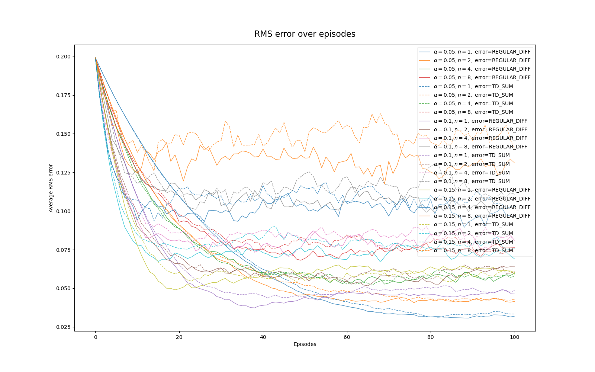

# n-step TD for value estimation

_Solution to Exercise 7.2_: Comparing n-step TD using two different ways of computing the error term:

1. Difference between target and estimate, where the value function changes across timesteps within an episode.

2. Sum of TD errors, where the value function is assumed to update only at the end of an episode.

In the above figure, each line represents the root mean squared error (RMSE) of the estimated value function and the actual value function, over 100 episodes, and averaged over 100 runs.

The TD-sum method (dashed lines) appears to obtain higher RMSE in earlier episodes - performing worse -, but after convergence (~100 episodes) the gap between the errors of the two methods close almost entirely. In some instances (e.g.: [$\alpha=0.05, n=2,$ error=REGULAR_DIFF] - top orange lines) the advantage of method nr. 1 is more pronounced.

Thus, although with not a large difference, the better algorithm is the one with timestep-wise value updates (nr. 1).